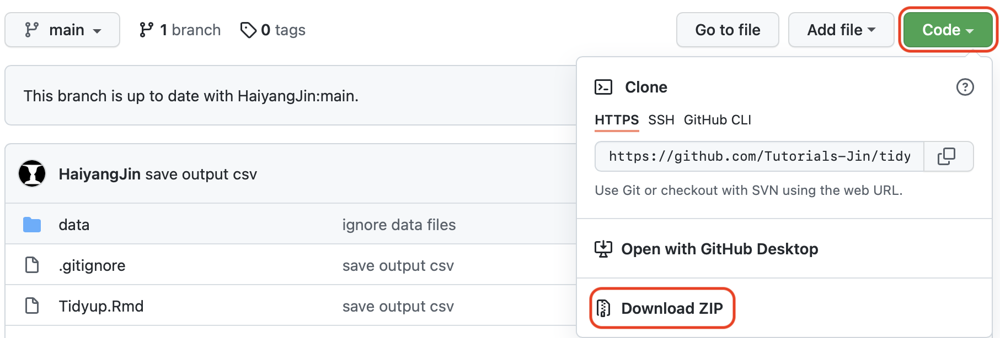
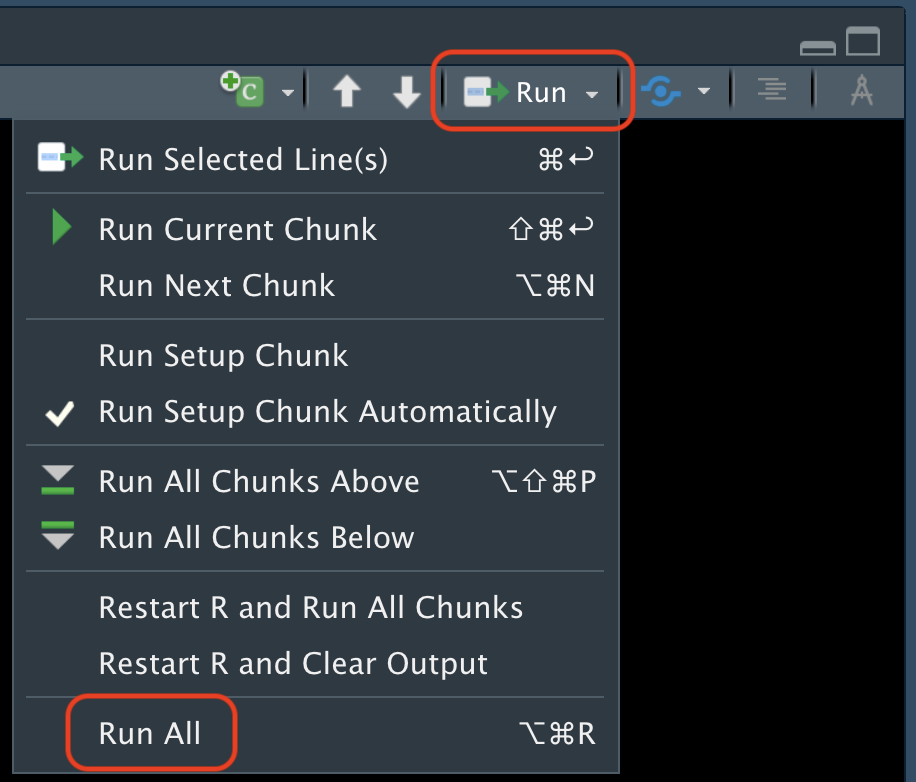
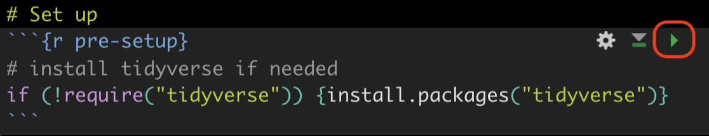

# Tutorial for tidying up data with R(Studio)

This tutorial (briefly) introduces the long and wide format of tidied up data and employs a concrete exmaple to convert raw data into the desired long and wide formats (although the data used are not avaiable publicly due to copyrights; at least currently).

 

## How to run the codes in this repository:  

0. Install [R](https://www.r-project.org) and [RStudio](https://www.rstudio.com);
1. Download this whole repository via:  
    
2. Open `Tidyup.Rmd` in the local folder;
3. Run all the codes in `Tidyup.Rmd` at once:  
     
4. (alternative to 3) Codes in each chunk could be run separately via (later codes may depend on earlier codes):  
     
